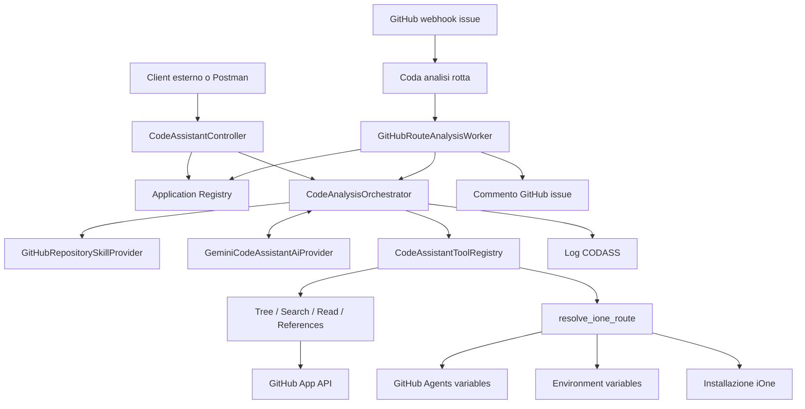

# Code Assistant AllBert — handoff tecnico per evoluzioni AI

> Stato rilevato dai sorgenti il 7 settembre 2026. Questo documento descrive il comportamento implementato, i confini di sicurezza e i punti corretti in cui estendere il sistema. In caso di divergenza, i sorgenti C# sono la fonte primaria.

## 1. Scopo

Il Code Assistant è un servizio backend ASP.NET Core centralizzato in `iOneAllBertWebApp`. Riceve domande in linguaggio naturale sul codice di applicazioni iOne conservate in repository GitHub privati e configurati. Gemini decide quali letture eseguire, ma può usare soltanto tool C# di sola lettura registrati dal backend.

Il caso principale è spiegare il comportamento di una schermata partendo da un codice rotta iOne. Il sistema può però analizzare anche endpoint, webservice, webhook, scheduler, processi batch, metodi o simboli indicati direttamente nella domanda.

La richiesta HTTP è stateless: una nuova chiamata non conserva la conversazione precedente.

## 2. Architettura



Principi fondamentali:

- AllBert sceglie repository, GitHub installation ID, commit e credenziali; Gemini non può modificarli.
- Il repository deve essere presente in `CodeAssistant:Applications` ed essere abilitato.
- Ogni analisi viene fissata allo SHA della testa del branch predefinito GitHub.
- Skill, tree, ricerche e letture usano lo stesso SHA per tutta la richiesta.
- Le skill sono istruzioni, non codice eseguibile e non una sorgente autonoma di privilegi.
- Gemini non accede direttamente a GitHub, iOne, filesystem, rete o segreti.
- Ogni azione reale passa da un tool C# presente nella allowlist del registry.
- Le fonti restituite al client sono costruite dal backend, non accettate dal testo prodotto dal modello.

## 3. Componenti principali

| Componente | Responsabilità |
| --- | --- |
| `CodeAssistantController` | API pubblica di analisi ed endpoint diagnostici |
| `ConfigurationCodeAnalysisApplicationRegistry` | Risolve applicazione e repository autorizzato dalla configurazione |
| `CodeAnalysisOrchestrator` | Seleziona skill, costruisce prompt, gestisce ciclo Gemini/tool, evidenze, retry e response |
| `GeminiCodeAssistantAiProvider` | Implementa Gemini `generateContent` e function calling REST |
| `CodeAssistantToolRegistry` | Espone ed esegue soltanto tool registrati |
| `GitHubCodeRepositoryClient` | Risolve commit, legge tree/blob, cerca testo e crea fonti GitHub |
| `GitHubRepositorySkillProvider` | Scopre e carica le skill del repository allo SHA fissato |
| `RepositorySkillCandidateSelector` | Assegna un punteggio di rilevanza alle skill rispetto alla domanda |
| `ResolveIOneRouteTool` | Recupera configurazione iOne e risolve un codice rotta |
| `IOneRouteHttpClient` | Esegue login e chiamate iOne necessarie a leggere le rotte autorizzate |
| `ReadRepositoryFileTool` | Legge righe del file e tenta la risoluzione deterministica del backend C# |
| `CodeAssistantAuditLogger` | Salva audit con `SistemaHelper.SaveUtentiLogFastAsync` |
| `GitHubRouteAnalysisQueue` | Coda in memoria per richieste originate da issue GitHub |
| `GitHubRouteAnalysisWorker` | Esegue l'analisi accodata e pubblica il commento sulla issue |

Registrazione dependency injection: `CodeAssistantServiceCollectionExtensions.AddCodeAssistantFoundation`.

## 4. API disponibili

### 4.1 API generica

```http
POST /CodeAssistant/analyze
Content-Type: application/json
```

```json
{
  "repositoryFullName": "iOneSolutionsSrl/iOneGavio",
  "question": "Nella rotta 000418 cosa fa il pulsante Cerca?",
  "modelId": "gemini-2.5-flash-lite"
}
```

`modelId` è opzionale. Se assente viene usato `CodeAssistant:ModelId`. Il repository viene confrontato, senza distinzione tra maiuscole e minuscole, con il registro configurato. Il client non fornisce `ApplicationCode`, installation ID, branch, commit o credenziali.

Struttura logica della response:

```json
{
  "applicationCode": "IONE_GAVIO",
  "repositoryFullName": "iOneSolutionsSrl/iOneGavio",
  "commitSha": "...",
  "answer": "...",
  "selectedSkills": ["ione-resolve-route"],
  "sources": [],
  "readSources": [],
  "toolExecutions": [
    { "name": "resolve_ione_route", "sourceCount": 0 }
  ],
  "model": "...",
  "usage": {
    "promptTokens": 0,
    "candidateTokens": 0,
    "totalTokens": 0
  }
}
```

Differenza importante:

- `sources`: tutte le fonti individuate dai tool, comprese le corrispondenze di ricerca;
- `readSources`: soltanto file e intervalli restituiti da `read_repository_file`, cioè il codice effettivamente fornito a Gemini.

### 4.2 Endpoint diagnostici

Sono attivi soltanto quando `CodeAssistant:DiagnosticsEnabled` è `true`:

| Metodo e route | Funzione |
| --- | --- |
| `GET /CodeAssistant/diagnostics/applications` | Elenco applicazioni configurate |
| `GET /CodeAssistant/diagnostics/applications/{code}/dependencies/ione` | Controllo URL, utente e disponibilità password senza esporre la password |
| `GET /CodeAssistant/diagnostics/applications/{code}/skills` | Catalogo skill del commit corrente |
| `POST /CodeAssistant/diagnostics/applications/{code}/skills/rank` | Ranking skill per una domanda |
| `GET /CodeAssistant/diagnostics/applications/{code}/skills/{skill}` | Skill completa e riferimenti Markdown |
| `POST /CodeAssistant/diagnostics/applications/{code}/routes/resolve` | Test isolato della risoluzione rotta iOne |
| `GET /CodeAssistant/diagnostics/tools` | Dichiarazioni e schemi dei tool |
| `POST /CodeAssistant/diagnostics/applications/{code}/tools/{tool}` | Esecuzione isolata di un tool |
| `POST /CodeAssistant/diagnostics/applications/{code}/analyze` | Analisi completa indicando `ApplicationCode` |

Gli endpoint diagnostici non costituiscono l'API applicativa generica e non devono essere abilitati in produzione senza protezione adeguata.

## 5. Registro applicazioni e configurazione

Ogni repository analizzabile deve avere una voce in `CodeAssistant:Applications`:

```json
{
  "ApplicationCode": "IONE_GAVIO",
  "Description": "iOne Gruppo Gavio",
  "GitHubOwner": "iOneSolutionsSrl",
  "GitHubRepository": "iOneGavio",
  "GitHubInstallationId": 12345,
  "IOnePasswordSecretReference": "CODEASSISTANT_SECRET_IONE_GAVIO_PASSWORD",
  "IOneAllowedHosts": ["ione.example.it"],
  "Enabled": true
}
```

Significato dei campi:

- `ApplicationCode`: identificatore interno univoco;
- `GitHubOwner` e `GitHubRepository`: repository autorizzato;
- `GitHubInstallationId`: installazione della GitHub App autorizzata sul repository;
- `IOnePasswordSecretReference`: nome della variabile d'ambiente che contiene la password tecnica;
- `IOneAllowedHosts`: allowlist dell'host iOne, usata come protezione SSRF;
- `Enabled`: interruttore applicativo.

La configurazione viene validata all'avvio. Sono rifiutati codici o repository duplicati, installation ID non validi, riferimenti secret non validi e allowlist host vuote o malformate.

Configurazione esterna necessaria:

- `GitHubApp` per App ID, chiave privata e base URL API;
- `GEMINI_API_KEY` nell'ambiente del processo, oppure `GeminiApi:ApiKey` per compatibilità;
- una variabile d'ambiente per ogni password iOne;
- `IONE_BASE_URL` e `IONE_USER` come GitHub Agents variables in ogni repository analizzato.

`Program.cs` carica `.env` tramite `DotNetEnv.Env.Load()`. Il file `.env` non deve essere versionato.

## 6. Skill del repository

Percorso unico:

```text
.agents/skills/<nome-skill>/SKILL.md
```

Ogni `SKILL.md` deve iniziare con front matter YAML. Metadati riconosciuti:

```yaml
---
name: nome-skill
description: Quando e perché applicare la skill
code-assistant: true
code-assistant-keywords:
  - parola chiave
  - altra parola
code-assistant-tools:
  - nome_tool_registrato
execution-mode: read-only
---
```

Sono supportati anche gli alias storici `ticket-assistant-keywords`, `ticket-executor` e `ticket-execution-mode`.

Funzionamento:

1. Il provider risolve la testa del branch predefinito e fissa lo SHA.
2. Legge ricorsivamente il tree sotto `.agents/skills`.
3. Costruisce un catalogo leggero con nome, descrizione, keyword, tool dichiarati e fonte.
4. Il selector assegna un punteggio usando nome, descrizione, keyword e presenza di identificatori numerici.
5. L'orchestratore carica soltanto le skill pertinenti, entro i limiti configurati.
6. Il contenuto della skill viene aggiunto alla system instruction di Gemini.
7. I riferimenti relativi a file `.md` nella stessa directory della skill possono essere caricati; script e altri file non vengono eseguiti.

Una skill può richiedere soltanto tool già implementati e registrati in AllBert. Aggiungere una chiamata API nel testo di una skill non crea automaticamente una capacità di rete: per una nuova API serve un nuovo tool C# controllato.

## 7. Tool disponibili

Il registry espone attualmente:

| Tool | Uso |
| --- | --- |
| `resolve_ione_route` | Risolve un codice rotta sull'installazione iOne associata all'applicazione |
| `get_repository_tree` | Elenca file consentiti nel commit fissato |
| `search_repository` | Cerca una stringa nel contenuto dei file consentiti |
| `read_repository_file` | Legge un intervallo limitato di righe di un file |
| `find_code_references` | Cerca riferimenti testuali a un simbolo |

Gli argomenti JSON sono validati in modo chiuso: proprietà non dichiarate vengono rifiutate. Owner, repository, installation ID e commit non fanno parte degli argomenti dei tool, perché provengono sempre dal contesto server-side.

### Policy repository

Estensioni consentite:

```text
.cs .vb .js .ts .tsx .jsx .html .htm .cshtml .vbhtml .css .scss
.sql .json .xml .config .md .yml .yaml .csproj .vbproj .sln
```

Sono esclusi directory generate o dipendenze come `.git`, `node_modules`, `bin`, `obj`, `packages`, `vendor`, `dist`, `build`, `coverage`, `.next`, `.nuxt`; sono esclusi anche file sensibili (`.env`, chiavi, certificati, `secrets.json`) e file minificati.

I path devono essere relativi, senza traversal, URL, query string, backslash o drive. `read_repository_file` tenta prima il path esatto e poi un suffisso univoco: `App/Views/...` può quindi risolvere `IOne/App/Views/...`. Più corrispondenze causano `repository_file_ambiguous`.

I blob GitHub sono richiesti con media type raw. Rimane un fallback per wrapper JSON Base64/UTF-8. Il contenuto deve essere testo UTF-8 e viene redatto quando una riga sembra contenere password, token, secret, API key, connection string o chiave privata. Durante una ricerca un file binario/non UTF-8 viene saltato e registrato; una lettura diretta dello stesso file fallisce esplicitamente.

## 8. Flusso di una analisi HTTP

1. Il controller valida repository, domanda e modello opzionale.
2. Il registry risolve l'applicazione configurata e verifica `Enabled`.
3. Il provider skill risolve lo SHA del branch predefinito.
4. Il selector ordina le skill; l'orchestratore carica quelle pertinenti.
5. La domanda viene classificata come:
   - interfaccia/rotta iOne;
   - scheduler/processo pianificato;
   - endpoint/webservice;
   - analisi generica.
6. Viene costruita una system instruction con regole universali, procedura specializzata e skill selezionate.
7. Gemini riceve conversazione, schemi dei tool, limite output, temperatura e modello.
8. Se Gemini restituisce function call, il registry valida ed esegue i tool.
9. I risultati diventano `functionResponse` nella conversazione Gemini.
10. Il ciclo continua fino a una risposta finale verificabile o al raggiungimento dei limiti.
11. L'orchestratore valida citazioni, path e quantità minima di evidenze.
12. Il controller restituisce risposta, SHA, skill, fonti, letture, tool, modello e token.

La risposta finale viene sempre richiesta in italiano; nomi tecnici, simboli, path, URL e codice restano invariati.

## 9. Analisi di una rotta iOne

### 9.1 Risoluzione della rotta

`resolve_ione_route` recupera:

- `IONE_BASE_URL` dalla GitHub Agents variable omonima;
- `IONE_USER` dalla GitHub Agents variable omonima;
- password con `Environment.GetEnvironmentVariable`, usando `IOnePasswordSecretReference`.

`IONE_BASE_URL` deve essere HTTPS e il suo host deve appartenere a `IOneAllowedHosts`.

`IOneRouteHttpClient` crea una sessione HTTP nuova per ogni risoluzione ed esegue:

1. `POST /Account/Login`;
2. `GET /` per leggere `anti-forgery-token`;
3. `GET /api/IOne/GetTokenCustom`;
4. `GET /api/IOne/GetSettings` con header AJAX e antiforgery;
5. ricerca case-insensitive del codice nell'array `rotte`.

Il risultato contiene `Codice`, `Controller`, `Url` e `Stato`. Una rotta assente significa soltanto che non è visibile all'account tecnico configurato. Più corrispondenze sono considerate ambigue.

### 9.2 Tracciamento view → JavaScript → C#

Per una domanda su pulsante, combo o controllo dati, la procedura attesa è:

1. leggere la view indicata dall'URL della rotta sotto `App/Views`;
2. usare il valore `controller` restituito da iOne come nome della registrazione AngularJS, non come filename;
3. cercare tale registrazione nel contenuto dei `.js` sotto `App/Controllers`;
4. leggere il path JavaScript effettivamente trovato;
5. individuare handler, funzione, `data-values`, `ng-model` e assegnazioni rilevanti;
6. ricostruire la chiamata frontend reale;
7. leggere `$scope.serviceName` nell'intero file JavaScript;
8. se è statico nel formato `api/Nome`, derivare `NomeController`;
9. cercare prima `Api/<stessa-area-js>/NomeController.cs`, poi tutte le sottocartelle di `Api`;
10. confermare nel contenuto la dichiarazione della classe;
11. leggere action, servizi, query, filtri e struttura dei valori necessari alla risposta.

Esempio:

```javascript
$scope.serviceName = "api/ConsegneCommittente";
```

Produce il candidato `ConsegneCommittenteController.cs`. `ReadRepositoryFileTool` restituisce inoltre un oggetto `BackendResolution` con stato, service name, classe attesa, prefisso preferenziale, path risolto e candidati.

`ApiControllers` non è considerato un percorso valido. Se `serviceName` è assente, dinamico o ambiguo, resta disponibile la discovery generica.

### 9.3 Requisito di evidenza

Una risposta che si limita a risolvere la rotta o afferma che sarebbe necessario leggere il codice non è accettata. Per pulsanti, combo e controlli dati l'orchestratore richiede normalmente:

- view HTML;
- controller JavaScript e implementazione dell'handler;
- controller/action C# quando emerge una chiamata backend.

Per una combo non basta descrivere `data-values`: bisogna trovare dove l'array viene assegnato e, se applicabile, seguire la chiamata backend fino a query, filtri e valori restituiti.

Se Gemini si ferma presto, l'orchestratore invia una continuazione e può forzare function calling `ANY` limitandolo ai tool necessari. Se le evidenze sono già sufficienti ma manca il testo finale, forza una sintesi con function calling disabilitato.

## 10. Scheduler, endpoint e analisi generica

Le regole AngularJS non sono universali:

- per scheduler/job/timer/batch si cercano registrazione, pianificazione, frequenza, condizioni di avvio, metodo eseguito, servizi, repository, dati modificati, errori e retry;
- per API/webservice/webhook si cercano route, verbo HTTP, action, parametri, autenticazione, validazioni, servizi/helper, accesso dati, response, errori ed effetti esterni;
- HTML e JavaScript vengono cercati in questi casi soltanto se la domanda o il codice mostrano un collegamento effettivo;
- per una domanda generica si parte dagli identificatori forniti e si espande l'analisi solo quanto necessario.

## 11. Ricerca, lettura e limiti attuali

Valori predefiniti definiti da `CodeAssistantOptions`:

| Opzione | Default |
| --- | ---: |
| `RepositoryCodeMaxTreeItems` | 50.000 |
| `RepositoryCodeMaxFileBytes` | 262.144 byte |
| `RepositoryCodeMaxLinesPerRead` | 400 righe |
| `RepositoryCodeSearchMaxFiles` | 120 file |
| `RepositoryCodeSearchMaxTotalBytes` | 8 MiB |
| `RepositoryCodeSearchMaxResults` | 100 |
| `AiMaxQuestionChars` | 10.000 |
| `AiMaxSelectedSkills` | 3 |
| `AiMaxSkillContextChars` | 60.000 |
| `AiMaxToolCalls` | 15 |
| `AiMaxEvidenceRetries` | 2 |
| `AiMaxProviderResponseRetries` | 1 |
| `AiMaxToolContextChars` | 1.000.000 |
| `AiMaxOutputTokens` | 4.096 |
| `AiTemperature` | 0,2 |

Comportamenti utili:

- `search_repository` cerca nel contenuto, non nel nome del file;
- una query `metodo()` viene normalizzata in `metodo`;
- se mancano estensioni, `App/Views` implica HTML, `App/Controllers` implica JavaScript e `Api` implica C#;
- i percorsi iOne standard sono tentati prima del fallback sui prefissi proposti dal modello;
- i risultati sono ordinati anche usando la somiglianza tra query e path;
- la riga della ricerca viene conservata come hint: una lettura successiva senza intervallo viene centrata sulla corrispondenza più avanzata invece di partire sempre dalla riga 1.

Limite importante dello stato attuale: i file oltre `RepositoryCodeMaxFileBytes` vengono esclusi dalle ricerche e una lettura diretta restituisce `repository_file_too_large`. Per supportare davvero file grandi serve una lettura streaming/range o un indice server-side; aumentare soltanto il limite aumenta memoria, token e latenza.

## 12. Gemini e prompt

Il provider chiama:

```text
POST {GeminiApi:BaseUrl}/v1beta/models/{modelId}:generateContent
```

La chiave viene inviata nell'header `x-goog-api-key`. Il modello predefinito è `CodeAssistant:ModelId`, ma la singola API può proporre un override validato sintatticamente.

La system instruction è costruita a runtime da `CodeAnalysisOrchestrator` e contiene:

- obbligo di risposta in italiano;
- repository e commit assegnati;
- divieto di inventare file, fonti o risultati;
- uso esclusivo dei tool autorizzati;
- distinzione tra procedure UI, scheduler, endpoint e generica;
- regole view → JavaScript → C# per applicazioni iOne;
- skill repository selezionate e loro riferimenti Markdown.

Gemini conserva nel turno successivo la propria risposta strutturata, comprese le function call e i relativi ID. I risultati dei tool vengono reinviati come `functionResponse`.

Una risposta HTTP 200 senza testo né function call viene classificata come risposta non utilizzabile. Il sistema registra metadati sicuri (`finishReason`, candidati, parti e token) e applica `AiMaxProviderResponseRetries`. I blocchi di sicurezza diventano `ai_provider_content_blocked` e non vengono ritentati.

## 13. Sicurezza e validazione delle fonti

- Nessun segreto viene inserito nel prompt o nella response.
- Il repository e il commit non sono controllabili da Gemini.
- Il modello non può registrare nuovi tool.
- Non esistono tool di scrittura sul repository o di esecuzione processi.
- I path e le estensioni sono validati lato server.
- Le righe lette sono sottoposte a redazione euristica dei segreti.
- Le citazioni GitHub vengono accettate soltanto se corrispondono a fonti prodotte dai tool.
- Un filename JavaScript inventato derivando il nome del controller AngularJS viene respinto e fatto correggere.
- Una applicazione disabilitata non può eseguire tool.

## 14. Logging e diagnostica

Le operazioni Code Assistant usano `ICodeAssistantAuditLogger`, che chiama:

```csharp
SistemaHelper.SaveUtentiLogFastAsync(
    dbContext,
    repository.Repository,
    note,
    SistemaHelper.LogTipoCodiceCodeAssistent);
```

Quindi:

- entità = nome del repository senza owner;
- tipo log = `CODASS` (`LogTipoCodiceCodeAssistent`).

I log ordinari includono tempi, SHA breve, tool, conteggi, errori classificati, ricerche redatte e stato della risoluzione backend. Il fallimento del logging non deve cambiare l'esito dell'analisi.

Il logging dettagliato Gemini è regolato da:

```json
{
  "DetailedAiLoggingEnabled": false,
  "DetailedAiLoggingMaxChars": 50000
}
```

Quando attivo registra prompt/conversazione, tool dichiarati, modello, risposta strutturata e correlation ID applicando redazione e troncamento. Deve normalmente essere `false` in produzione. Attenzione: nel `appsettings.json` rilevato alla data di questo documento il valore è impostato a `true`, mentre il default della classe `CodeAssistantOptions` è `false`.

## 15. Integrazione con issue GitHub

Oltre alla API HTTP esiste un flusso asincrono:

1. `GitHubWebhookController` riceve un evento `labeled` sulla route esistente `POST /Post`.
2. Se la label è `iOneResolveRoute`, `GitHubWebhookHelper` cerca nel titolo/body una espressione `rotta NNNNNN`.
3. Verifica che nel repository esista `.agents/skills/ione-resolve-route/SKILL.md`.
4. Accoda `GitHubRouteAnalysisRequest` in una coda in memoria con capacità 100.
5. La chiave repository + issue + rotta impedisce duplicati contemporanei.
6. `GitHubRouteAnalysisWorker` forza la skill `ione-resolve-route` e la prima chiamata a `resolve_ione_route`.
7. Esegue la normale analisi del repository.
8. Verifica che skill e resolver siano stati realmente usati.
9. Pubblica la risposta come commento della issue GitHub, includendo rotta e commit.

La coda ha un solo reader, non è persistente e si perde al riavvio del processo. I log di questa pipeline usano attualmente la categoria GitHub (`LogTipoCodiceGitHub`), non `CODASS`, per le operazioni esterne di trigger/commento.

## 16. Errori HTTP principali

Formato:

```json
{
  "error": {
    "code": "repository_evidence_not_found",
    "message": "...",
    "dependency": null
  }
}
```

| HTTP | Significato tipico |
| ---: | --- |
| `400` | domanda, repository, modello, path, range o argomenti non validi |
| `403` | applicazione disabilitata |
| `404` | applicazione/repository/skill/file non trovato |
| `422` | limite tool/contesto, evidenze insufficienti o fonte/path non verificato |
| `424` | errore di Gemini, GitHub App, Agents variables, secret o iOne |

Codici frequenti:

```text
question_required
repository_full_name_required
repository_full_name_invalid
repository_not_configured
model_id_invalid
agent_tool_limit_reached
agent_context_limit_reached
repository_evidence_not_found
repository_file_not_found
repository_file_too_large
repository_file_invalid_content
unverified_repository_path_reference
unverified_source_citation
ai_provider_request_failed
ai_provider_invalid_response
ai_provider_content_blocked
agent_variable_not_found
```

## 17. Come aggiungere una nuova applicazione

1. Installare/autorizzare la GitHub App sul repository.
2. Concedere almeno lettura dei contenuti e accesso alle Agents variables richieste.
3. Recuperare l'installation ID corretto.
4. Aggiungere una voce univoca in `CodeAssistant:Applications`.
5. Creare nel repository `IONE_BASE_URL` e `IONE_USER`.
6. Aggiungere la password come variabile d'ambiente del processo AllBert.
7. Configurare `IOneAllowedHosts` con il solo host autorizzato.
8. Pubblicare almeno una skill valida sotto `.agents/skills` se serve una procedura specializzata.
9. Verificare prima gli endpoint diagnostici e poi `POST /CodeAssistant/analyze`.

## 18. Come aggiungere una skill

Se la skill usa soltanto capacità esistenti:

1. creare `.agents/skills/<nome>/SKILL.md` nel repository analizzato;
2. compilare `name`, `description`, keyword e `code-assistant-tools`;
3. scrivere istruzioni operative deterministiche, indicando quando fermarsi e quali prove leggere;
4. aggiungere eventuali riferimenti `.md` relativi nella directory della skill;
5. verificare catalogo, ranking e caricamento tramite diagnostica;
6. provare una analisi completa e controllare `selectedSkills`, `toolExecutions` e `readSources`.

Non serve modificare AllBert finché tutti i tool dichiarati esistono già.

## 19. Come aggiungere un nuovo tool o una nuova fonte dati

Una nuova chiamata API, database o fonte esterna richiede codice backend:

1. definire un client/interfaccia dedicato che incapsuli autenticazione, timeout, limiti e allowlist;
2. definire modelli di input/output privi di segreti;
3. implementare `ICodeAssistantTool` con nome stabile e JSON Schema minimo;
4. validare gli argomenti con `CodeAssistantToolJson.ReadObject` e helper correlati;
5. ricavare identità, repository e credenziali dal contesto server-side, mai dagli argomenti Gemini;
6. registrare il tool con `services.AddScoped<ICodeAssistantTool, NuovoTool>()`;
7. aggiungere la dichiarazione del tool alle skill che possono usarlo;
8. produrre `CodeAssistantSourceReference` solo per evidenze realmente lette e verificabili;
9. integrare audit `CODASS` senza payload sensibili;
10. aggiungere test di schema, autorizzazione, errori, timeout, redazione e happy path;
11. aggiornare i criteri di evidenza dell'orchestratore soltanto se il nuovo dominio lo richiede.

Per collegare una fonte non-GitHub è consigliabile introdurre un tipo di riferimento distinto o estendere esplicitamente il modello delle fonti. Non simulare URL GitHub per dati provenienti da sistemi diversi.

## 20. Come aggiungere un provider AI

1. implementare `ICodeAssistantAiProvider` preservando conversazione strutturata e tool call ID;
2. tradurre gli `AiToolDeclaration` nel formato del provider;
3. reinviare i risultati come risposte tool native;
4. applicare timeout, limite risposta, gestione blocchi di sicurezza e diagnostica sanitizzata;
5. registrare il nuovo client in dependency injection;
6. rendere la scelta del provider server-side e autorizzata;
7. non alterare le garanzie dell'orchestratore su repository, commit, fonti e limiti.

L'orchestratore è già separato dal formato Gemini tramite `ICodeAssistantAiProvider`, ma la configurazione e la registrazione correnti selezionano soltanto Gemini.

## 21. Limiti e debito tecnico da considerare nelle migliorie

- Nessuna autenticazione/autorizzazione specifica è applicata dal `CodeAssistantController`.
- Le richieste HTTP sono stateless e non esiste cronologia multi-turno persistente.
- La coda GitHub è in memoria, single-reader e non resiliente ai riavvii.
- Il branch è sempre quello predefinito; non esiste una allowlist o selezione di branch.
- Non esiste indice simbolico, full-text persistente o vector store: le ricerche scansionano blob entro budget.
- I file oltre 256 KiB, con i default correnti, non possono essere cercati o letti.
- La selezione skill è lessicale e semplice; Gemini decide poi l'uso effettivo.
- I riferimenti skill sono soltanto Markdown e gli script delle skill non vengono eseguiti.
- Solo Gemini è configurato come provider.
- Non esistono tool di scrittura, modifica repository o esecuzione codice.
- `DetailedAiLoggingEnabled` è attualmente `true` nel file di configurazione rilevato: verificare l'intenzione prima della produzione.
- Il webhook `POST /Post` e la futura API Code Assistant richiedono una revisione esplicita di autenticazione, autorizzazione, firma e rate limiting.

## 22. File da leggere prima di modificare il sistema

Ordine consigliato:

1. `iOneAllBertWebApp.Domain/CodeAssistant/Configuration/CodeAssistantOptions.cs`
2. `iOneAllBertWebApp.Domain/CodeAssistant/CodeAssistantServiceCollectionExtensions.cs`
3. `iOneAllBertWebApp/Controllers/CodeAssistantController.cs`
4. `iOneAllBertWebApp.Domain/CodeAssistant/Services/CodeAnalysisOrchestrator.cs`
5. `iOneAllBertWebApp.Domain/CodeAssistant/Services/GeminiCodeAssistantAiProvider.cs`
6. `iOneAllBertWebApp.Domain/CodeAssistant/Services/CodeAssistantToolRegistry.cs`
7. `iOneAllBertWebApp.Domain/CodeAssistant/Services/GitHubCodeRepositoryClient.cs`
8. `iOneAllBertWebApp.Domain/CodeAssistant/Services/GitHubRepositorySkillProvider.cs`
9. `iOneAllBertWebApp.Domain/CodeAssistant/Services/ReadRepositoryFileTool.cs`
10. `iOneAllBertWebApp.Domain/CodeAssistant/Services/IOneRouteHttpClient.cs`
11. `iOneAllBertWebApp.Domain/Helpers/GitHubWebhookHelper.cs`
12. `iOneAllBertWebApp.Domain/CodeAssistant/Services/GitHubRouteAnalysisWorker.cs`

## 23. Test

I test dedicati sono in `iOne.Tests` e coprono almeno:

- validazione configurazione e registrazione servizi;
- application registry e diagnostica;
- provider secret d'ambiente;
- GitHub installation token e Agents variables;
- discovery/caricamento skill;
- client repository, path, raw blob, ricerca e fonti;
- registry e singoli tool;
- client iOne e risoluzione rotta;
- provider Gemini e function calling;
- orchestratore, evidenze, retry e validazioni finali;
- coda e comment builder GitHub.

Comando mirato indicativo:

```powershell
dotnet test .\iOneAllBertWebApp\iOne.Tests\iOne.Tests.csproj --filter "FullyQualifiedName~CodeAssistant|FullyQualifiedName~CodeAnalysisOrchestrator|FullyQualifiedName~GitHubCodeRepositoryClient|FullyQualifiedName~GitHubRepositorySkillProvider|FullyQualifiedName~IOneRoute|FullyQualifiedName~GitHubRouteAnalysis"
```

Ogni modifica a tool, prompt, policy, fonti o provider deve includere test sul percorso positivo e sui confini di sicurezza.

## 24. Checklist per una AI che propone migliorie

Prima di implementare:

- verificare il comportamento nei sorgenti e nei test, non soltanto nei documenti;
- distinguere una skill da un tool eseguibile;
- conservare repository e commit come contesto immutabile server-side;
- non passare segreti a Gemini;
- non allargare path, estensioni o rete senza una policy esplicita;
- decidere se una nuova fonte genera evidenze citabili e come rappresentarle;
- mantenere separati `sources` e `readSources`;
- aggiornare limiti e validator insieme;
- aggiungere logging utile ma sanitizzato;
- considerare l'impatto su token, latenza e numero di tool call;
- aggiornare questo handoff e la documentazione operativa dopo la modifica.

